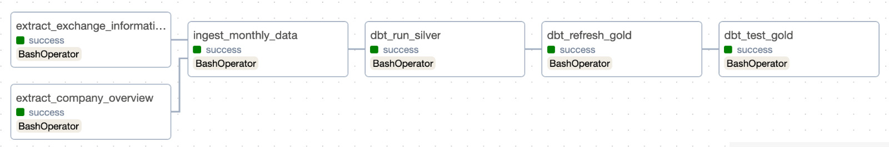
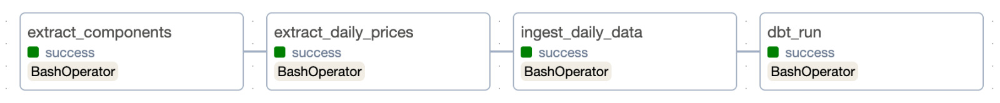

# Project: Data Orchestration with Airflow, dbt, and ClickHouse

# Part 2 (see Part 3 below)

This project implements an end-to-end data orchestration pipeline. It automates the process of extracting financial data, loading it into a data warehouse, and transforming it for analytics.

The pipeline leverages the following stack:
- **Apache Airflow:** For orchestrating and scheduling data workflows.
- **dbt (Data Build Tool):** For transforming data within the warehouse.
- **ClickHouse:** For storing our data.

## Environment Overview

This project runs a containerized environment using Docker Compose, orchestrating several key services:

*   **Airflow:** The core of the orchestration pipeline, running with a `LocalExecutor`. It consists of a web server and a scheduler. The DAGs (`dags/`), data (`data/`), and dbt project (`dbt/`) directories are mounted from your local machine, allowing for easy development and modification.
    *   **Webserver:** Accessible at `http://localhost:8080`.
*   **ClickHouse:** The primary data warehouse for storing stock data.
    *   **HTTP Interface:** Accessible on port `8123`.
    *   **Native Interface:** Accessible on port `9000`.
*   **PostgreSQL:** Serves as the metadata database for Airflow.

This setup is defined in the `compose.yml` file, which links these services together and manages their configuration, volumes, and networking.

## Orchestration (Airflow DAGs)

The `dags/` directory contains the Airflow DAGs that orchestrate the entire ETL pipeline.

-   **`daily_market_etl`**: This DAG runs every weekday. It extracts the latest daily stock prices, ingests the data into ClickHouse, and then triggers a `dbt run` to transform the data.
-   **`monthly_reference_etl`**: Scheduled for the first of each month, this DAG extracts and ingests reference data (company and exchange information). It then runs the dbt models, performs a full refresh on the final "gold" tables, and runs data quality tests.

## Pipeline Scripts

The core logic of the data pipeline is contained within a series of Python scripts located in `dags/scripts/`. These are orchestrated by Airflow to perform extraction and ingestion tasks.

### Data Extraction

Extraction scripts are responsible for fetching data from various web sources and saving it locally as CSV files.

-   **Daily Stock Data:** Scripts run daily to download the latest stock prices for S&P 500 and S&P 600 companies using the `yfinance` library.
-   **Company & Exchange Data:** On a monthly basis, scripts extract foundational data, including detailed company profiles from `yfinance` and a list of major stock exchanges from Wikipedia.

### Data Ingestion

Ingestion scripts take the raw CSV files produced by the extraction process and load them into the ClickHouse database.

-   The scripts connect to the ClickHouse service and execute `INSERT` queries to bulk-load data from the CSV files into the appropriate tables.
-   This process is divided into daily and monthly ingestion tasks to handle the different data cadences.

## Data Transformation (dbt)

The `dbt/` directory houses the dbt project responsible for the transformation phase of the pipeline. It transforms the raw, ingested data into a structured star schema suitable for analytics.

-   **Staging Models:** Raw data from the `sp600_stocks` database is first cleaned and standardized in staging models, which are materialized as views.
-   **Marts Models:** The final, user-facing models are built in the `marts` directory. This includes:
    -   `dim_date`: A calendar dimension table.
    -   `dim_company` and `dim_exchange`: Dimension tables that track historical changes using a Slowly Changing Dimension (SCD) Type 2 approach.
    -   `fact_stock_price`: A central fact table that joins stock data with the dimensions, loaded incrementally to improve performance.
-   **Data Quality:** The project includes data tests to validate the integrity and relationships within the final models.

## Database Initialization

The `clickhouse_init/` directory contains SQL scripts crucial for setting up the ClickHouse database when the Docker environment starts.

-   **Schema Definition:** The `01_create_db_and_tables.sql` script defines the `sp600_stocks` database and all the necessary tables for storing daily stock data, S&P 500/600 components, company details, and exchange information.
-   **Historical Data Loading:** The `02_load_historic_data.sql` script populates these newly created tables with historical data from predefined CSV files, ensuring the database has a foundational dataset upon initialization.

## Quick Start

Follow these steps to get the pipeline running from a clean state.

1.  **Navigate to the Docker Directory**

    All commands should be run from the `Docker/` directory.
    ```bash
    cd Docker
    ```

2.  **Clean Up Previous Runs**

    To ensure a completely fresh start, you can tear down any existing containers and volumes, and clear out the data from previous runs.
    ```bash
    docker compose down -v
    rm -f data/daily/*
    rm -f data/monthly/*
    ```

3.  **Launch the Environment**

    Build fresh images and start all the services in detached mode.
    ```bash
    docker compose up --build -d
    ```
    Monitor the logs until you see the confirmation that the Airflow webserver is running and listening on port 8080.

4.  **Access the Airflow UI**

    Once the services are running, open your web browser and navigate to:
    [http://localhost:8080](http://localhost:8080)

    Log in with the default credentials:
    -   **Username:** `admin`
    -   **Password:** `admin`

5.  **Run the Pipelines**

    In the Airflow UI, you will see two DAGs.

    -   First, enable the `daily_market_etl` DAG and wait for it to complete.
    -   Then, enable the `monthly_reference_etl` DAG.

6.  **Verify the Data in ClickHouse**

    While the Docker environment is running, you can connect to the ClickHouse database to query the data.
    ```bash
    docker compose exec clickhouse clickhouse-client --database sp600_stocks
    ```

    Once inside the client, you can run queries to inspect the tables:
    ```sql
    SHOW TABLES;

    SELECT count(*) FROM fact_stock_price;

    SELECT * FROM dim_company LIMIT 5;
    ```
# DAG screenshots
### Monthly Reference ETL DAG

### Daily Market ETL DAG



# Query Results
## **1️⃣ Top 3 Most-Traded Companies per Sector (Q1 2025)**

**Query:**
```sql
SELECT c.sector, c.company_name, SUM(f.volume) AS total_volume
FROM fact_stock_price f
INNER JOIN dim_company c ON f.company_id = c.company_id
INNER JOIN dim_date d ON f.date_id = d.date_id
WHERE d.year=2025 AND d.quarter=1
GROUP BY c.sector, c.company_name
ORDER BY c.sector, total_volume DESC
LIMIT 3 BY c.sector;
```

**Results:**

| Sector | Company | Total Volume |
|--------|---------|--------------|
| **Basic Materials** | Hecla Mining Company | 1,153,165,600 |
| | Freeport-McMoRan Inc. | 964,415,700 |
| | Newmont Corporation | 617,209,700 |
| **Communication Services** | Alphabet Inc. | 3,059,700,500 |
| | AT&T Inc. | 2,527,613,900 |
| | Warner Bros. Discovery Inc. | 2,129,251,300 |
| **Consumer Cyclical** | Ford Motor Company | 6,018,623,500 |
| | Tesla, Inc. | 5,811,328,000 |
| | Amazon.com, Inc. | 2,402,912,500 |
| **Consumer Defensive** | Walmart Inc. | 1,225,172,500 |
| | The Coca-Cola Company | 1,092,430,700 |
| | Kenvue Inc. | 897,901,800 |
| **Energy** | Exxon Mobil Corporation | 968,237,200 |
| | The Williams Companies, Inc. | 927,376,000 |
| | SLB N.V. | 925,498,300 |
| **Financial Services** | Bank of America Corporation | 2,326,152,200 |
| | MARA Holdings, Inc. | 2,313,459,600 |
| | Robinhood Markets, Inc. | 2,160,466,100 |
| **Healthcare** | Pfizer Inc. | 2,719,008,500 |
| | Merck & Co., Inc. | 962,927,100 |
| | Viatris Inc. | 799,880,800 |
| **Industrials** | JetBlue Airways Corporation | 1,406,912,400 |
| | CSX Corporation | 889,661,400 |
| | Southwest Airlines Co. | 650,476,700 |
| **Real Estate** | Medical Properties Trust, Inc. | 748,574,600 |
| | Host Hotels & Resorts, Inc. | 529,731,400 |
| | VICI Properties Inc. | 432,861,300 |
| **Technology** | NVIDIA Corporation | 16,881,581,500 |
| | Intel Corporation | 5,987,377,600 |
| | Palantir Technologies Inc. | 5,936,378,100 |
| **Utilities** | PG&E Corporation | 1,417,848,900 |
| | The AES Corporation | 924,850,600 |
| | NextEra Energy, Inc. | 703,953,300 |

---

## **2️⃣ Change in Average Price by Sector (2024–2025)**

**Query:**
```sql
SELECT d.year, c.sector, AVG(f.close) AS avg_close_price
FROM fact_stock_price f
INNER JOIN dim_company c ON f.company_id=c.company_id
INNER JOIN dim_date d ON f.date_id=d.date_id
WHERE d.year BETWEEN 2024 AND 2025
GROUP BY d.year, c.sector
ORDER BY d.year, c.sector;
```

**Results:**

| Year | Sector | Avg Close Price |
|------|--------|-----------------|
| 2024 | Basic Materials | 114.97 |
| 2024 | Communication Services | 94.26 |
| 2024 | Consumer Cyclical | 188.85 |
| 2024 | Consumer Defensive | 85.64 |
| 2024 | Energy | 65.44 |
| 2024 | Financial Services | 98.78 |
| 2024 | Healthcare | 138.82 |
| 2024 | Industrials | 142.05 |
| 2024 | Real Estate | 58.08 |
| 2024 | Technology | 141.51 |
| 2024 | Utilities | 64.71 |
| 2025 | Basic Materials | 105.13 |
| 2025 | Communication Services | 113.86 |
| 2025 | Consumer Cyclical | 201.68 |
| 2025 | Consumer Defensive | 84.21 |
| 2025 | Energy | 69.56 |
| 2025 | Financial Services | 113.57 |
| 2025 | Healthcare | 127.31 |
| 2025 | Industrials | 155.65 |
| 2025 | Real Estate | 58.31 |
| 2025 | Technology | 148.29 |
| 2025 | Utilities | 77.44 |

---

## **3️⃣ Sector Composition of S&P 500 Companies (2024 & 2025)**

**Query:**
```sql
SELECT d.year, c.sector,
       countDistinct(c.company_id) AS company_count,
       round(countDistinct(c.company_id) / sum(countDistinct(c.company_id)) OVER (PARTITION BY d.year) * 100, 2) AS pct_share
FROM fact_stock_price f
INNER JOIN dim_company c ON f.company_id=c.company_id
INNER JOIN dim_date d ON f.date_id=d.date_id
WHERE d.year IN (2025, 2024)
GROUP BY d.year, c.sector
ORDER BY d.year, pct_share DESC;
```

**Results:**

| Year | Sector | Company Count | % Share |
|------|--------|---------------|---------|
| 2024 | Financial Services | 172 | 15.62 |
| 2024 | Technology | 157 | 14.26 |
| 2024 | Industrials | 155 | 14.08 |
| 2024 | Consumer Cyclical | 140 | 12.72 |
| 2024 | Healthcare | 132 | 11.99 |
| 2024 | Real Estate | 92 | 8.36 |
| 2024 | Consumer Defensive | 64 | 5.81 |
| 2024 | Energy | 53 | 4.81 |
| 2024 | Basic Materials | 48 | 4.36 |
| 2024 | Communication Services | 45 | 4.09 |
| 2024 | Utilities | 43 | 3.91 |
| 2025 | Financial Services | 172 | 15.58 |
| 2025 | Technology | 159 | 14.40 |
| 2025 | Industrials | 155 | 14.04 |
| 2025 | Consumer Cyclical | 140 | 12.68 |
| 2025 | Healthcare | 132 | 11.96 |
| 2025 | Real Estate | 93 | 8.42 |
| 2025 | Consumer Defensive | 64 | 5.80 |
| 2025 | Energy | 53 | 4.80 |
| 2025 | Basic Materials | 48 | 4.35 |
| 2025 | Communication Services | 45 | 4.08 |
| 2025 | Utilities | 43 | 3.89 |

---

## **4️⃣ Highest Average Relative Volatility (Q1 2025)**

**Query:**
```sql
SELECT c.company_name, c.sector,
       AVG((f.high - f.low)/f.open) AS avg_relative_volatility
FROM fact_stock_price f
INNER JOIN dim_company c ON f.company_id=c.company_id
INNER JOIN dim_date d ON f.date_id=d.date_id
WHERE d.year=2025 AND d.quarter=1 AND f.open>0
GROUP BY c.company_name, c.sector
ORDER BY avg_relative_volatility DESC
LIMIT 5;
```

**Results:**

| Company | Sector | Avg Relative Volatility |
|---------|--------|-------------------------|
| Super Micro Computer, Inc. | Technology | 0.0897 |
| SolarEdge Technologies, Inc. | Technology | 0.0847 |
| Sandisk Corporation | Technology | 0.0830 |
| Viasat, Inc. | Technology | 0.0815 |
| CleanSpark, Inc. | Financial Services | 0.0808 |

---

## **5️⃣ Top 10 Companies by Price Growth (Q1 2025)**

**Query:**
```sql
WITH q1 AS (
    SELECT c.company_id,
           any(c.company_name) AS company_name,
           any(c.sector) AS sector,
           anyIf(f.close, d.month='Jan') AS jan_close,
           anyIf(f.close, d.month='Mar') AS mar_close
    FROM fact_stock_price f
    INNER JOIN dim_company c ON f.company_id=c.company_id
    INNER JOIN dim_date d ON f.date_id=d.date_id
    WHERE d.year=2025 AND d.quarter=1
    GROUP BY c.company_id
)
SELECT company_name, sector, jan_close, mar_close,
       (mar_close - jan_close)/jan_close*100 AS pct_growth
FROM q1
WHERE jan_close>0 AND mar_close IS NOT NULL
ORDER BY pct_growth DESC
LIMIT 10;
```

**Results:**

| Company | Sector | Jan Close | Mar Close | % Growth |
|---------|--------|-----------|-----------|----------|
| Corsair Gaming, Inc. | Technology | 6.98 | 10.97 | 57.16 |
| CVS Health Corporation | Healthcare | 42.75 | 63.54 | 48.63 |
| Pitney Bowes Inc. | Industrials | 7.08 | 10.47 | 47.92 |
| Medical Properties Trust, Inc. | Real Estate | 3.83 | 5.50 | 43.78 |
| Stride, Inc. | Consumer Defensive | 106.34 | 139.44 | 31.13 |
| Philip Morris International Inc. | Consumer Defensive | 118.03 | 154.77 | 31.12 |
| Tapestry, Inc. | Consumer Cyclical | 64.81 | 83.04 | 28.13 |
| CSG Systems International, Inc. | Technology | 49.80 | 63.36 | 27.22 |
| Privia Health Group, Inc. | Healthcare | 19.64 | 24.96 | 27.09 |
| Dana Incorporated | Consumer Cyclical | 11.06 | 14.00 | 26.58 |

---------------------------------------------------------------------------------------------------------------------------------

# Part 3

## Quickstart (including Part 2)

1. **Create a Docker Network**

    ```bash
    docker network create shared-analytics-net
    ```

2. **Ensure you are in the project_two/Docker directory**

3. **Start the main compose file:**

    ```bash
    docker compose up -d
    ```
4.  **Access the Airflow UI**

    Once the services are running, open your web browser and navigate to:
    [http://localhost:8080](http://localhost:8080)

    Log in with the default credentials:
    -   **Username:** `admin`
    -   **Password:** `admin`

5.  **Run the Pipelines**

    In the Airflow UI, you will see two DAGs.

    -   First, enable the `daily_market_etl` DAG and wait for it to complete.
    -   Then, enable the `monthly_reference_etl` DAG.

6. Follow the instructions in Docker/superset/README.md

7. Follow the instructions in Docker/openmetadata-infra/README.md

## Project Components Summary

This section provides a brief overview of the key components located in the `Docker` directory.

#### MinIO Data (`minio_data`)

This directory serves as the persistent storage volume for the MinIO service. MinIO is an object storage server, and in this project, it is used to store data, particularly for the Iceberg data lakehouse tables. The contents are primarily binary data and system files managed by MinIO.

#### ClickHouse Views (`views`)

This directory contains SQL scripts for managing access control and creating analytical views in the ClickHouse database.

*   **Role-Based Access Control (RBAC):** The scripts `01_create_roles_and_users.sql` define two roles (`analyst_full` and `analyst_limited`) with different levels of permissions.
*   **Column-Level Security:** The `analyst_limited` role has restricted access to sensitive columns in the `dim_company` table.
*   **Data Pseudonymization:** For the `analyst_limited` role, the `02_create_analytical_views.sql` script creates views that provide pseudonymized data for sensitive columns (e.g., masking company names and URLs).
*   **Cleanup:** The `00_cleanup.sql` script is provided to drop the created users, roles, and views.
*   ****README:** The `README.md` inside the "views" directory provides further information.

#### Apache Superset (`superset`)

This directory contains the necessary files to run Apache Superset, a data visualization and business intelligence platform.

*   **Docker Compose:** The `superset_compose.yml` file defines the services required to run Superset, including the Superset application itself, a PostgreSQL database for its metadata, and Redis for caching.
*   **Configuration:** The `docker/pythonpath_dev/superset_config.py` file contains the Python configuration for the Superset application, where database connections and other settings are defined.
*   **README:** The `README.md` in the "superset" directory provides instructions on how to start the Superset services and connect to the ClickHouse database.

#### OpenMetadata Infrastructure (`openmetadata-infra`)

This directory contains the infrastructure setup for OpenMetadata, a data discovery, lineage, and governance tool.

*   **Docker Compose:** The `docker-compose.yml` file orchestrates the deployment of OpenMetadata along with its dependencies, including MySQL for metadata storage and Elasticsearch for search.
*   **Setup and Integration:** The `README.md` in the "openmetadata-infra" directory provides detailed information on how to set everything up, how to connect it to Clickhouse and Superset, and on the general architecture.